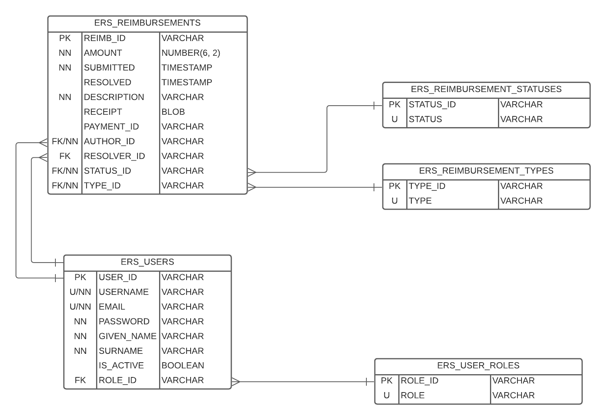

# P1-Eric-Will
### Project 1 Belonging To Will and Eric

[Click-up Link/Check List](https://sharing.clickup.com/24523362/l/h/qcck2-3161/56843f4b0631506)

## Index
- Project Description
- Technologies
- MVP
- ER diagram
- Contributors

## Project Description

### Brief

You are tasked with building an API that will support a new internal expense reimbursement system. 
This system will manage the process of reimbursing employees for expenses incurred while on company time.
~~This system will work closely with the internal PRISM application~~ - which is used for processing payments to employees. 
All registered employees in the company can login and submit requests for reimbursement and view their past tickets 
and pending requests. Finance managers can log in and view all reimbursement requests and past history for 
all employees in the company. Finance managers are authorized to approve and deny requests for expense reimbursement.

### Roles
- Admin
- User
- Finance Manager
- Employee

## Phases 

### Pre Phase (06-03-2022)
- ~~Project requirements delivered~~
### Phase 1
- ~~Remote repository is created and is being kept up to date~~
- Core model classes are created
- Registration/Authentication/User operations in progress
- Rudimentary logging (to file) in place
### Phase 2
- Local DB instance running
- App to DB connection made
- Specified tables created with proper constraints
- Registration/Authentication/User operations complete
- Reimbursement operations in progress
- Basic persistence layer operations in progress
- Testing of business logic is in progress
### Phase 3
- Reimbursement operations complete (pending PRISM integration)
- PRISM integration in progress
- Registration/Authentication web endpoints are accessible and functional
- Reimbursement web endpoints are accessible and functional
- User passwords are encrypted when persisted to the DB
- Testing of business logic is in progress
### Final
- Project Presentations

## Technologies
Persistence Tier

- PostGreSQL (running on Docker)
- Application Tier

- Java 8
- Apache Maven
- JDBC
- Java EE Servlets
- JSON Web Tokens
- JUnit
- Mockito

## MVP
    - Lorem ipsum dolor sit amet

## ER diagram

## Contributors
    - Eric 
    - Will
